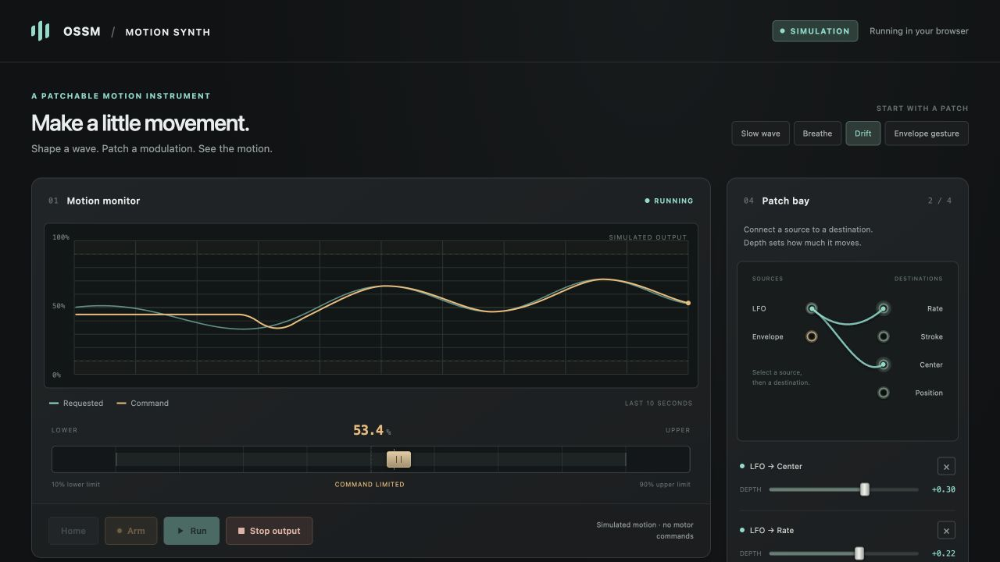

# OSSM Motion Synth

A patchable motion instrument in your browser. Shape a waveform, connect virtual
modulation cables, hear the signal, and control an OSSM directly through a
USB–RS485 adapter using Web Serial.

This is the standalone web synth spun out of
[OSSM-Synth](https://github.com/lucy-chapar/OSSM-Synth). It includes the browser
interface, a standalone browser runtime and an optional local Python bridge.
No Raspberry Pi, CV board or firmware flash is needed.



## Use it on the web

Open [OSSM Motion Synth](https://lucychapar.com/ossm-motion-synth/) in desktop
Chrome or Edge. In **Motor connection**, click **Connect** and choose your
USB–RS485 adapter, then **Home → Play**. Home measures both ends of the rail
and parks at center. No Python app or installation is required.

**Wiring:** With power off, disconnect the 4-pin signal cable that runs to the
OSSM motherboard. This setup only needs 24 V power and USB–RS485 wired directly
to the motor.

The synth also runs without an adapter: patch waves, watch the scope, and expand
**Audio preview** at the bottom to hear them. Browsers without Web Serial can
use those controls, with motor connection unavailable.

Motor commands run in the browser. Leaving the tab requests a stop; a closed,
suspended or crashed browser cannot guarantee delivery of a software stop.
Physical stop/power isolation remains independent. The browser edition has
been tested with a connected OSSM; see the [guide](docs/GUIDE.md) for the
measured rail check and drive compatibility details.

## Optional Python bridge

Requires Python 3.11 or later.

```sh
git clone https://github.com/lucy-chapar/ossm-motion-synth.git
cd ossm-motion-synth
python3 -m venv .venv
.venv/bin/python -m pip install .
./synth --open
```

The interface opens at **http://127.0.0.1:8765** in simulation mode. Choose a
preset, then **Play**. Use `--port NUMBER` if that port is already in use.
The installed `ossm-motion-synth` command and `python -m virtual_synth` launch
the same application. On Windows, use `.venv\Scripts\python -m pip install .`
and `.venv\Scripts\python -m virtual_synth --open` after creating the environment.

- Sine, triangle, saw and square waveforms with rate, stroke and center controls.
- A patch bay connecting LFO and attack/release envelope to rate, stroke, center
  or position, with positive and negative cable depth.
- A scope showing requested and planned motion, plus encoder feedback when connected.
- Lower and upper travel controls, hover help, and a collapsible audio preview.
- USB–RS485 connection, sensorless homing of both rail ends, measured travel,
  and parking at center before waveform motion.

## Connect an OSSM

```sh
./synth --allow-motion --open
```

Select the adapter, then **Connect → Home → Play**. Home stays disabled
until a motor is connected. Connection reads status; Home finds both ends and
parks at the measured center. Run starts the waveform. The bridge uses 19200
baud, 8N1, slave 1 and never selects a port automatically.

The bridge retains bounded trajectories, 20-second hardware runs, feedback
checks and stop-on-lost-heartbeat behavior. Sensorless rail measurement has
offline test coverage; physical validation is still outstanding. **Stop output**
is a software command, separate from physical stop/power isolation.

See the [guide](docs/GUIDE.md) for audio mappings, patch behavior, homing details,
connection requirements and recovery behavior.

## Development

```sh
.venv/bin/python -m unittest discover -s tests -v
node --test tests/*.cjs
```

Tests use fake serial devices and require no motor. Node.js 22 or later runs the
audio, browser engine, controller and Web Serial tests, including comparisons
against the Python engine. There is no frontend build step. All browser assets
are included and run without a CDN.

The optional Python bridge binds to loopback and accepts only same-origin
control requests. The website edition connects directly to a USB–RS485 adapter
through Web Serial; it does not require the Python bridge.

## Host the browser edition

```sh
python3 scripts/export_web.py --output dist/web
```

Serve that directory on **HTTPS** (localhost also works for development).
Relative assets allow deployment at a subpath. The export includes source
attribution and a SHA-256 manifest so a website can pin the exact version.
It makes no calls to a Python API or cloud control service.

For an Astro island, host the export under `public/apps/ossm-motion-synth/`
and load it in a same-origin iframe with `allow="serial 'self'; autoplay 'self'"`.
The iframe keeps the instrument styles separate from the surrounding site.
Any parent `Permissions-Policy` must allow `serial=(self)`.

Web Serial access is granted through the browser's chooser after a user click;
previously allowed adapters are listed without opening them. The app never
auto-connects or auto-runs. See the
[Web Serial API documentation](https://developer.chrome.com/docs/capabilities/serial).

## License

[MPL-2.0](LICENSE). See [NOTICE.md](NOTICE.md) for provenance and acknowledgements.
